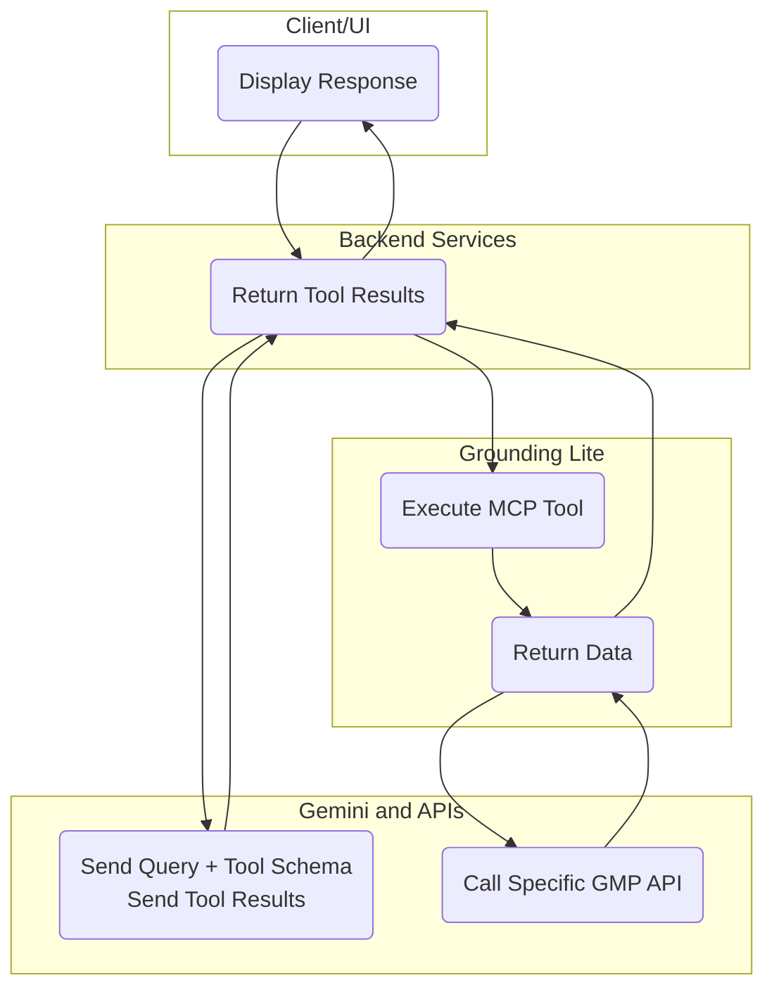

# Grounding Lite Sample App


## Overview

This repository contains a sample application demonstrating the use of [**Grounding Lite**](https://developers.google.com/maps/ai/grounding-lite) with the [Gemini API](https://ai.google.dev/gemini-api/docs) to provide spatially grounded responses using Google Maps Platform data. The application uses the agent to converse and a companion 3D Google Maps.

Please refer to the official documentation for more details: [Grounding Lite Documentation](https://developers.google.com/maps/ai/grounding-lite).

## Architecture

The application employs a client-server architecture where a Node.js backend hosts the Model Context Protocol (MCP) server, allowing the Gemini model to dynamically access real-time geographic information via Google Maps Platform tools.


### Key Components

*   **Client (Web App)**: Built with Vite and Lit, handles user chat interaction and displays the dynamic 3D map (using the Maps JavaScript API).
*   **Backend Server (Node/Express)**: Acts as a central proxy, managing communication between the Client, the Gemini API, and hosting the MCP Server.
*   **Grounding Lite MCP Server**: Exposes a set of custom tools to the Gemini model, providing the capability to ground its responses in real-world geographic data.
*   **MCP Tools**: Custom functions defined by the MCP server that translate natural language requests into structured Google Maps Platform API calls (`Places API`, `Routes API`, `Elevation API`).
*   **Gemini API**: The Large Language Model (LLM) that leverages the provided MCP tools for geographically accurate, grounded responses.

### Data Flow Diagram (Grounding Lite)



## Prerequisites

- A Google Cloud Project with the necessary APIs enabled
- Create API keys
   - Server API Key:
      - **Grounding Lite**  MCP Service
      - Gemini API (aka Generative Language API)
      - Complementary APIs to manage the 3D map:
         - Routes API for the polyline
         - Places API (New) for the name of the businesses on markers
         - Elevation API to adjust camera altitude to the map location
   - Client API key:
      - Maps JavaScript API
      - Places UI Kit
- Node.js and npm installed.

## Installation
### Key Dependencies

*   **[Vite](https://www.npmjs.com/package/vite)**: A fast, modern development server and build tool for web projects.
*   **[@google/genai](https://www.npmjs.com/package/@google/genai)**: The official SDK for interacting with the Google Gemini API.
*   **[@modelcontextprotocol/sdk](https://www.npmjs.com/package/@modelcontextprotocol/sdk)**: The SDK for creating and interacting with Model Context Protocol (MCP) servers.
*   **[Lit](https://www.npmjs.com/package/lit)**: A simple library for building fast, lightweight web components.
*   **[Tailwind CSS](https://www.npmjs.com/package/tailwindcss)**: A utility-first CSS framework for rapidly building custom user interfaces.
*   **[Express](https://www.npmjs.com/package/express)**: A minimal and flexible Node.js web application framework used for the backend server.
*   **[dotenv](https://www.npmjs.com/package/dotenv)**: A zero-dependency module that loads environment variables from a `.env` file.


1. Install the dependencies:

```sh
npm install
```

2. Configure your environment:

Create a `.env` file in the root directory and add your API keys.

For the frontend (Google Maps JavaScript API loading), use:
```
GOOGLE_MAPS_API_KEY="YOUR_GOOGLE_MAPS_API_KEY"
```

For the server-side (Maps Platform MCP calls and Gemini API calls), use:
```
SERVER_API_KEY="YOUR_SERVER_API_KEY_HERE"
```

### Choosing the AI provider (Gemini or Cerebras/Gemma)

The conversational agent can be driven by either the Gemini API (default) or by
**Gemma-4-31B on Cerebras inference**. Select the provider with `AI_PROVIDER`:

```
# "gemini" (default) or "cerebras"
AI_PROVIDER="cerebras"

# Required when AI_PROVIDER=cerebras
CEREBRAS_API_KEY="YOUR_CEREBRAS_API_KEY"

# Optional: override the Cerebras model id (defaults to "gemma-4-31b-trial")
CEREBRAS_MODEL="gemma-4-31b-trial"
```

`SERVER_API_KEY` is still required regardless of provider, because it
authenticates the Google Maps Grounding Lite MCP server that supplies the
`search_places`, `lookup_weather`, and `compute_routes` tools.

The Cerebras path additionally supports **multimodal image input**: `POST /api/chat`
accepts an optional `images` array of base64 data URLs (`data:image/png;base64,...`,
PNG/JPEG only, up to 5 per request). The frontend upload UI for this is a planned
follow-up; the backend already accepts and forwards the images.

## Architecture


## Running the Application

This application uses `concurrently` to run both the Vite frontend server and the Node.js backend server (which hosts the Model Context Protocol (MCP) server).

### Development Mode

Run the application in development mode:

```sh
npm run dev
```

This command executes: `concurrently "vite" "npm run dev:server:watch"`

*   The frontend (Vite) will typically run on `http://localhost:5173`.
*   The backend server (Node.js/Express) handles the MCP server setup and API routes.

### Production Build

1. Build the application:

```sh
npm run build
```

2. Start the production server:

```sh
npm start
# or
npm run start:prod
```

## Cloud Run Deployment

This application can be deployed to Google Cloud Run by building and deploying directly from the source code.

1.  **Ensure prerequisites are met**: You must have the Google Cloud CLI installed and authenticated.
2.  **Deploy the application**: Run the following command, replacing the environment variable placeholders and project ID with your values.

    > **Note**: For this sample app to function correctly, you must pass the `SERVER_API_KEY` (for server-side Google Maps Platform and Gemini APIs) and `GOOGLE_MAPS_API_KEY` (for client-side Maps JavaScript API) as environment variables.

1.  **Use the deployment script**: We have provided a generic deployment script, `deploy.sh`, which reads `SERVER_API_KEY` and `GOOGLE_MAPS_API_KEY` directly from your local `.env` file and passes them securely to the `gcloud run deploy` command.

    The generic script requires the GCP Project ID and Region as arguments:

```sh
./deploy.sh YOUR_GCP_PROJECT_ID us-central1
```

## Terms of Service

This is a sample application provided for demonstration purposes.

This sample application is not a Google Maps Platform Core Service. Therefore, the Google Maps Platform Terms of Service (e.g. Technical Support Services, Service Level Agreements, and Deprecation Policy) do not apply to the code in this solution.

## Support

This sample application is offered via an open source license. It is not governed by the Google Maps Platform [Support Technical Support Services Guidelines](https://cloud.google.com/maps-platform/terms/tssg), the [SLA](https://cloud.google.com/maps-platform/terms/sla), or the [Deprecation Policy](https://cloud.google.com/maps-platform/terms) (however, any Google Maps Platform services used by the sample application remain subject to the Google Maps Platform Terms of Service).

If you find a bug, or have a feature request, please [file an issue](https://github.com/googlemaps-samples/grounding-lite-mcp-sample-app/issues) on GitHub. If you would like to get answers to technical questions from other Google Maps Platform developers, ask through one of our [developer community channels](https://developers.google.com/maps/developer-community). If you'd like to contribute, please check the Contributing guide.
